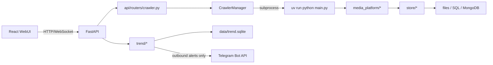
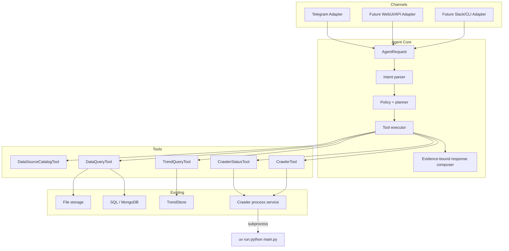
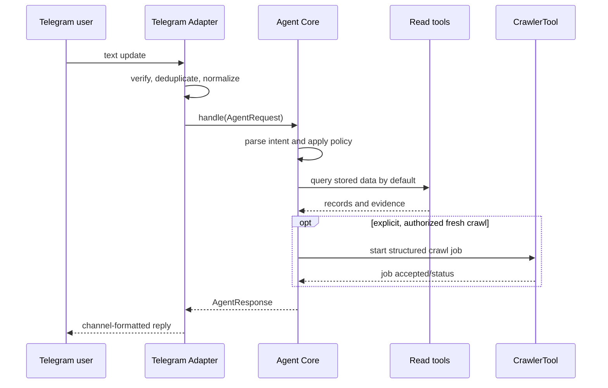

# Agent + Telegram Architecture

## Scope

This is an architecture-only proposal. No existing code or dependency is changed.
It preserves the React WebUI and the crawler subprocess contract:

    uv run python main.py

Telegram is a thin inbound adapter. It is not a crawler entry point and it
does not contain business logic. Agent Core remains independent of Telegram so
future channels can reuse it.

## 1. Current architecture

| Area | Location | Current responsibility |
| --- | --- | --- |
| Crawler CLI | main.py, cmd_arg/arg.py | Parses CLI parameters, sets module-level config, creates platform crawler, initializes DB storage when needed, runs crawler. |
| React WebUI | webui/src/App.tsx | React/Vite UI with SCAN and TREND_RADAR tabs; calls FastAPI only. |
| API | api/main.py | FastAPI app, static WebUI serving, routers, WebSocket, Trend scheduler lifecycle. |
| Crawler process manager | api/services/crawler_manager.py | Builds args from CrawlerStartRequest, starts one subprocess with uv run python main.py, streams logs and tracks status. |
| Crawler platforms | media_platform/* | Platform-specific crawler implementations. |
| Storage writers | store/*, tools/async_file_writer.py | Platform-specific writers for files, SQL and MongoDB. |
| Trend Radar | trend/* | Separate scoring/read model, outbound Telegram alerts, scheduler, optional LLM product-name helper. |



Storage is heterogeneous. JSON/JSONL/CSV data is normally written below
data/<platform>/<format>; SAVE_DATA_PATH can change that base. SQL uses
database/models.py and database/db_session.py; selected storage depends on the
crawler's global runtime config. Trend Radar has a dedicated SQLite read model,
data/trend.sqlite, accessed through TrendStore in trend/store.py.

The existing api/routers/data.py browses only JSON, CSV and Excel under the
default data directory. It is a WebUI HTTP router, not a reusable repository.
Each platform has its own storage factory (for example DouyinStoreFactory and
XhsStoreFactory), but there is no shared read-side repository abstraction.

Telegram already appears in trend/alerts.py, but only as one-way alert delivery
to configured TREND_TELEGRAM_CHAT_ID. There is no inbound Telegram update
handler. Likewise, trend/llm_extract.py is an optional product-name extraction
helper; it is not an Agent, generic tool layer, or factual data source.

Dependencies are managed by pyproject.toml and uv (with a legacy
requirements.txt). The React package has separate npm dependencies in
webui/package.json. No Telegram inbound SDK, Agent framework, tool registry,
Agent Core, generic repository, or conversation/audit store currently exists.

## 2. Target architecture

Use a ports-and-adapters design. An adapter normalizes an external message into
AgentRequest and renders AgentResponse. Intent parsing, authorization, planning,
tool selection, data access policy and factual response construction reside in
Agent Core.



Rules:

1. channels/telegram only validates/normalizes updates and sends formatted
   responses. It must not query a database, choose a tool, assemble crawl
   arguments, import crawler code, or make authorization/business decisions.
2. agent_core has no Telegram SDK types, bot token, chat ID, Telegram markup,
   or Telegram update fields.
3. CrawlerTool is the only Agent-facing capability that can start a crawler.
   It delegates to a shared service that retains the existing subprocess.
4. Data-query tools are selected first. CrawlerTool is eligible only for an
   explicit fresh-data request, complete parameters and successful authorization.
5. Claims in answers are allowed only when supported by ToolResult evidence.
   No matching evidence produces a transparent no-data/clarification response.

## 3. Telegram flow

Polling versus webhook is a deployment choice behind the same transport port.



The adapter passes a channel-neutral actor identity, conversation ID, message
ID, locale, timestamp and safe metadata. It may send a processing acknowledgement
for slow work, but cannot alter planning or tool calls. It must deduplicate
Telegram update IDs so retry delivery never reruns a tool.

Existing Trend Radar outbound alerts remain independent from this feature. The
existing alert token and fixed chat ID must not grant a conversational Telegram
user access to data or crawler actions.

## 4. Agent flow

1. Validate AgentRequest, establish actor roles, and apply request bounds.
2. Convert text into a schema-valid AgentIntent. An LLM may assist parsing, but
   parsing output is not factual evidence.
3. Ask a focused clarification if intent is uncertain, scope conflicts, or
   required parameters are absent.
4. Plan data-first: select a read-only catalog/data/trend/status tool first.
5. Run only allowlisted tools whose typed inputs, authorization, quota and
   deadline pass policy.
6. Collect structured ToolResult and Evidence from every execution.
7. Compose a response only from the retrieved result/evidence.
8. Persist a redacted audit record. Conversation memory can add context but
   cannot substitute tool evidence for a factual statement.

An absent, stale, unreadable or insufficient source must be stated as such.
The Agent must never infer record values, trends or crawl completion from model
knowledge, the user prompt, or a successful process start.

## 5. AgentRequest and Intent design

Define transport-neutral Pydantic/dataclass contracts in agent_core/contracts.py.

```python
class AgentRequest:
    request_id: str
    channel: Literal["telegram", "webui", "api", "cli"]
    actor: ActorRef                 # neutral identity and roles
    conversation_id: str
    message_id: str
    text: str
    locale: str | None
    received_at: datetime
    metadata: Mapping[str, str]     # non-secret only

class AgentIntent:
    kind: Literal[
        "search_stored_data", "get_record", "summarize_trend",
        "list_sources", "crawler_status", "request_crawl", "help", "unknown"
    ]
    platforms: list[Platform]
    query: str | None
    record_ids: list[str]
    time_range: TimeRange | None
    fields: list[str]
    freshness: Literal["stored_only", "allow_crawl"]
    confidence: float
    clarification_needed: str | None
```

Freshness defaults to stored_only. The word "latest" means search stored data
and report record timestamps; it does not silently launch collection. Only
clear collection/refresh language plus permission can set allow_crawl.

Intent values are enumerated and bounded. They cannot contain arbitrary CLI
fragments, filesystem paths, executable names or environment overrides. Unknown
or low-confidence intent returns needs_clarification without calling a write
tool.

AgentResponse separates message from machine state:

- status: answered, needs_clarification, no_data, accepted, failed or denied;
- evidence: source IDs, timestamps and retrieval scope;
- job: optional asynchronous job reference;
- suggested_actions: safe next actions.

## 6. Tool interface

Tools are application ports. They receive validated models and return structured
results, never unbounded answer prose.

```python
class AgentTool(Protocol[ToolInputT, ToolResultT]):
    name: str
    input_model: type[BaseModel]

    async def execute(
        self, input: ToolInputT, context: ToolContext
    ) -> ToolResultT: ...

class ToolResult(BaseModel):
    status: Literal["ok", "not_found", "pending", "invalid", "denied", "failed"]
    data: JSONValue | None
    evidence: list[Evidence]
    warnings: list[str]
    job: JobRef | None
```

ToolContext supplies correlation ID, roles, deadline, cancellation, locale and
audit logger. It must not contain Telegram objects or raw secrets. Evidence
identifies an approved source (such as a trend table, safe relative data-file
locator, or crawl job), retrieval timestamp, record count/IDs and safe hash or
excerpt.

Initial registry:

| Tool | Default | Responsibility |
| --- | --- | --- |
| DataSourceCatalogTool | Yes | List available approved sources and their recency. |
| DataQueryTool | Yes | Search/get normalized crawler content and comments. |
| TrendQueryTool | Yes | Read TrendStore products, videos, snapshots, listings, alerts and scan state. |
| CrawlerStatusTool | Yes | Report existing managed crawler status and safe log summary. |
| CrawlerTool | No | Validate and enqueue/start a permitted crawler subprocess. |

The registry is explicit and allowlisted. The Agent cannot call arbitrary Python,
shell, URLs, database tables or paths.

## 7. Data access flow

Create read-side repository ports instead of importing FastAPI routers or
platform storage writers into Agent Core:

```text
Agent Core -> DataQueryTool -> ContentRepository
                              -> FileContentRepository (JSON/JSONL/CSV/Excel)
                              -> SqlContentRepository (SQLite/MySQL/Postgres)
                              -> MongoContentRepository

Agent Core -> TrendQueryTool -> TrendRepository -> existing TrendStore
```

Begin with only backends that are genuinely supported and report unsupported or
missing storage explicitly. Do not silently fall back. File readers enforce an
approved root derived from SAVE_DATA_PATH/default data location and reject
traversal, symlinks outside root, malformed files, oversized scans and
unapproved extensions.

Repository output should be a normalized ContentRecord/CommentRecord projection:
platform, record ID, URL, title/description/content, timestamps, counters,
source keyword and source locator. Platform-specific data is a bounded extra
map. This prevents conversation logic from depending on per-platform dict
shapes.

Every factual answer includes source scope and recency. The current LLM product
name in Trend Radar is metadata/helper output, not a source of truth.

## 8. CrawlerTool

CrawlerTool is a privileged asynchronous tool. Its CrawlCommand maps to the
existing CrawlerStartRequest semantic fields: platform, login type, crawl type,
keywords or detail/creator IDs, pagination/count/comment/headless/save options,
and requester authorization.

Its implementation delegates to CrawlerProcessService, a reusable seam
extracted from or wrapped around api/services/crawler_manager.py. Both the
existing FastAPI crawler router and CrawlerTool use this same service. It keeps:

- uv run python main.py and PROJECT_ROOT as working directory;
- argument-list execution rather than shell execution;
- the single-active-process guard, stdout/stderr capture, lifecycle, stop and
  log/status behavior;
- existing CLI parsing and platform crawler code unchanged.

CrawlerTool returns accepted/pending with a job ID, state and sanitized
parameters. It never blocks Telegram until completion, and never says records
exist merely because a process started. A later CrawlerStatusTool and data
query are the evidence for completion and persistence.

## 9. Response generation

The composer receives only AgentIntent, ToolResult values and Evidence. It has
no raw filesystem, DB or network access.

- State factual claims only when present in successful result data.
- Allow arithmetic only if source inputs and formula are retained as evidence.
- Distinguish no match, unavailable source, ambiguous request, queued/running
  crawl, and failed tool.
- State stored timestamps when users ask for current/live data but records are
  historical.
- Bound result size; summarize retrieved rows only, then offer a safe narrowing
  action or authorized crawl request.
- For LLM-backed parsing/composition, require schema validation and verify that
  each cited record/evidence ID exists in tool results. On failure, return a
  template-based evidence summary or safe error.

## 10. Error handling

| Situation | Core result | Adapter behavior |
| --- | --- | --- |
| Non-text update | reject/help before Core | Explain supported input briefly. |
| Duplicate update | reuse result/job state | Never execute tools twice. |
| Ambiguous intent | needs_clarification | Ask one focused question. |
| No records | no_data with source/scope | Do not invent an answer. |
| Malformed/unavailable source | failed, sanitized reason/correlation ID | Never expose stack traces/secrets. |
| Crawler already active | existing job/status | Report it is running. |
| Invalid/auth/quota crawl | invalid or denied | Do not start process. |
| Telegram delivery failure | business result remains audited | Retry safely with backoff. |

## 11. Security

- Keep bot tokens, LLM keys, DB credentials, cookies and proxies in environment
  or secret management; redact them from replies, tool results, logs and audit.
- Treat Telegram identity as untrusted until verified. Keep role mapping outside
  Agent Core and deny crawler/sensitive operations by default.
- Verify webhook secrets when applicable; deduplicate update IDs to resist
  replay.
- Enforce message length, rate limits, concurrency, deadlines, result caps and
  crawler quotas before execution.
- Validate crawler values against current enums/ranges; never accept raw CLI
  flags, shell text, arbitrary save paths, executables, cookies or environment
  overrides in chat.
- Use parameterized database access and allowlisted source roots. Protect file
  parsing and preserve current anonymization/redaction principles.
- Keep minimal redacted audit events: actor pseudonym, intent, selected tool,
  sanitized input, result status and evidence IDs. Define retention before
  storing conversation content.

## 12. Folder/package structure

```text
agent_core/
  contracts.py          # AgentRequest, AgentIntent, AgentResponse, Evidence
  service.py            # channel-neutral handle(request)
  parser.py             # structured intent parsing and validation
  policy.py             # authorization, data-first, anti-hallucination policy
  planner.py
  responder.py          # evidence-bound answer construction
  tool_registry.py
  audit.py

agent_tools/
  base.py
  data_catalog.py
  data_query.py
  trend_query.py
  crawler.py
  crawler_status.py

repositories/
  contracts.py
  files.py
  sql.py
  mongo.py
  trend.py              # adapter around existing TrendStore

channels/
  telegram/
    adapter.py          # Telegram update <-> neutral contracts
    transport.py        # polling or webhook
    formatter.py        # length/markup chunking only
    settings.py
  webui/                # future adapter, not a React rewrite

services/
  crawler_process.py    # shared subprocess lifecycle service
```

Existing api/, trend/, store/, database/, media_platform/, main.py and webui/
remain in place. CrawlerProcessService may initially remain below api/services,
but its interface must not depend on FastAPI.

## 13. Migration plan

1. Freeze/test the existing WebUI crawler API and command behavior.
2. Extract/wrap only the CrawlerManager process seam; retain routes, WebSocket
   logs, status shape and exact crawler subprocess contract.
3. Add contracts, tool registry and read repositories with no inbound channel.
   Start with TrendStore and one confirmed crawler storage reader.
4. Add read-only Agent Core and tests for no-data, ambiguity and evidence-only
   replies. Keep CrawlerTool disabled by policy.
5. Add the thin Telegram Adapter and transport; it calls only AgentCore.handle.
6. Pilot read-only access and observe audit, parser accuracy, rate limits and
   no-data behavior.
7. Enable CrawlerTool only for authorized roles, explicit refresh requests and
   job-status follow-up.
8. Add channels by adapter, not by changing Core/tool logic. Keep the React
   WebUI fully functional throughout.

## 14. Phase-by-phase implementation plan

### Phase 0 — baseline and decisions

Document supported read backends, polling/webhook deployment choice, identity
and role source, crawl confirmation policy, quotas and audit retention. Add
regression tests for CrawlerManager command construction and its existing API.

### Phase 1 — process and read seams

Introduce the reusable crawler process service without changing main.py or
platform crawlers. Add repository contracts, DataSourceCatalogTool,
TrendQueryTool and one bounded DataQueryTool backend with evidence.

### Phase 2 — read-only Agent Core

Implement contracts, parser, policy, registry, planner, composer and audit
interface. Test Vietnamese/English requests, invalid input, no data, malformed
source, output bounds and claims-not-in-evidence rejection.

### Phase 3 — Telegram Adapter

Implement transport, update validation, identity normalization, deduplication,
Telegram formatting/chunking and delivery retry. Verify this package imports no
crawler, TrendStore, repository or policy/business modules.

### Phase 4 — controlled crawler capability

Implement CrawlerTool with strict models, authorization, quotas, confirmations,
job IDs and status evidence. Test that Telegram cannot call main.py directly,
plus busy process, cancellation, duplicate updates, failed subprocess and
post-run persistence verification.

### Phase 5 — operations and expansion

Add redacted metrics/audit events, health checks and runbooks. Add readers and
channel adapters incrementally while keeping tool contracts stable and the
current React WebUI unchanged.

