# Tài liệu kiến trúc Trend Radar / crawler

## 1. Tổng quan dự án

### 1.1 Giới thiệu

Product **Trend Radar**: crawl Douyin (TikTok VN phụ) để tìm sản phẩm hot Trung Quốc, chấm HeatNow/Confidence, gửi Telegram. Lớp crawler đa nền tảng xuất phát từ MediaCrawler.

### 1.2 Nền tảng hỗ trợ

| Nền tảng | Mã | Chức năng chính |
|------|------|---------|
| Douyin | `dy` | Tìm video, chi tiết, creator — nguồn nhiệt chính |
| TikTok VN | `tiktok` | Tìm video, chi tiết — nguồn nhiệt phụ |
| Xiaohongshu | `xhs` | Tìm ghi chú, chi tiết, creator |
| Kuaishou | `ks` | Tìm video, chi tiết, creator |
| Bilibili | `bili` | Tìm video, chi tiết, UP |
| Weibo | `wb` | Tìm weibo, chi tiết, blogger |
| Baidu Tieba | `tieba` | Tìm bài, chi tiết |
| Zhihu | `zhihu` | Tìm Q&A, chi tiết, người trả lời |

### 1.3 Tính năng cốt lõi

- **Nhiều nền tảng**: giao diện crawler thống nhất, Douyin/TikTok cho Trend Radar
- **Trend Radar**: HeatNow, Confidence, Telegram, draft Shopee/Lazada
- **Nhiều cách đăng nhập**: QR, số điện thoại, Cookie
- **Nhiều cách lưu**: CSV, JSON, JSONL, SQLite, MySQL, MongoDB, Excel
- **Chống phát hiện**: chế độ CDP, pool IP proxy, ký request
- **Bất đồng bộ**: asyncio

---

## 2. Kiến trúc tổng thể

### 2.1 Sơ đồ tầng cao

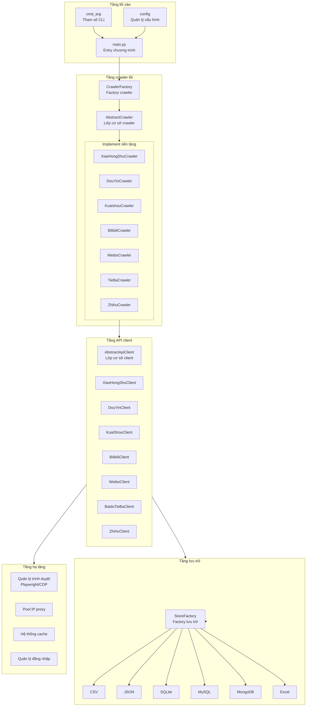

### 2.2 Luồng dữ liệu

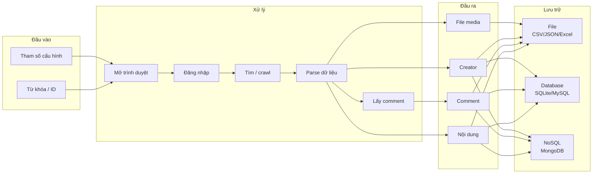

---

## 3. Cấu trúc thư mục

```
MediaCrawler/
├── main.py                 # Entry chương trình
├── var.py                  # Biến context toàn cục
├── pyproject.toml          # Cấu hình dự án
│
├── base/                   # Lớp trừu tượng
│   └── base_crawler.py     # Cơ sở crawler, login, store, client
│
├── config/                 # Quản lý cấu hình
│   ├── base_config.py      # Cấu hình lõi
│   ├── db_config.py        # Cấu hình database
│   └── {platform}_config.py # Cấu hình từng nền tảng
│
├── media_platform/         # Implement crawler nền tảng
│   ├── xhs/                # Xiaohongshu
│   ├── douyin/             # Douyin
│   ├── kuaishou/           # Kuaishou
│   ├── bilibili/           # Bilibili
│   ├── weibo/              # Weibo
│   ├── tieba/              # Baidu Tieba
│   └── zhihu/              # Zhihu
│
├── store/                  # Lưu trữ dữ liệu
│   ├── excel_store_base.py # Cơ sở lưu Excel
│   └── {platform}/         # Implement từng nền tảng
│
├── database/               # Tầng database
│   ├── models.py           # Model ORM
│   ├── db_session.py       # Session
│   └── mongodb_store_base.py # Cơ sở MongoDB
│
├── proxy/                  # Quản lý proxy
│   ├── proxy_ip_pool.py    # Pool IP
│   ├── proxy_mixin.py      # Mixin làm mới proxy
│   └── providers/          # Nhà cung cấp proxy
│
├── cache/                  # Cache
│   ├── abs_cache.py        # Lớp trừu tượng
│   ├── local_cache.py      # Cache local
│   └── redis_cache.py      # Cache Redis
│
├── tools/                  # Tiện ích
│   ├── app_runner.py       # Chạy ứng dụng, shutdown
│   ├── browser_launcher.py # Mở trình duyệt
│   ├── cdp_browser.py      # Quản lý CDP
│   ├── crawler_util.py     # Tiện ích crawler
│   └── async_file_writer.py # Ghi file bất đồng bộ
│
├── model/                  # Model dữ liệu
│   └── m_{platform}.py     # Model Pydantic
│
├── libs/                   # Thư viện JS
│   └── stealth.min.js      # Script chống phát hiện
│
└── cmd_arg/                # Tham số CLI
    └── arg.py              # Định nghĩa tham số
```

---

## 4. Module lõi

### 4.1 Hệ lớp cơ sở crawler

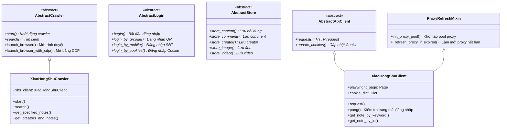

### 4.2 Vòng đời crawler

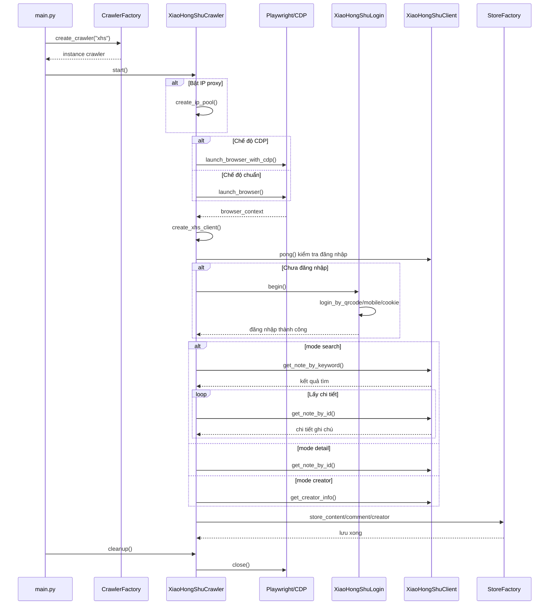

### 4.3 Cấu trúc implement từng nền tảng

Mỗi thư mục nền tảng gồm:

```
media_platform/{platform}/
├── __init__.py         # Export module
├── core.py             # Class crawler chính
├── client.py           # API client
├── login.py            # Đăng nhập
├── field.py            # Field / enum
├── exception.py        # Exception
├── help.py             # Hàm phụ
└── {implement đặc thù}.py
```

### 4.4 Ba mode crawler

| Mode | Giá trị config | Mô tả | Khi dùng |
|------|--------|---------|---------|
| Search | `search` | Tìm nội dung theo từ khóa | Lấy hàng loạt theo chủ đề |
| Detail | `detail` | Lấy chi tiết theo ID | Đã biết ID |
| Creator | `creator` | Lấy toàn bộ nội dung creator | Theo dõi blogger / UP |

---

## 5. Tầng lưu trữ

### 5.1 Sơ đồ lưu trữ

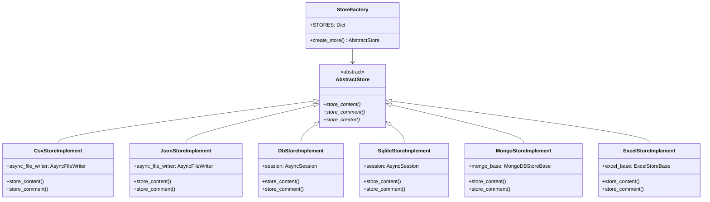

### 5.2 Factory lưu trữ

```python
# Ví dụ Douyin
class DouyinStoreFactory:
    STORES = {
        "csv": DouyinCsvStoreImplement,
        "db": DouyinDbStoreImplement,
        "json": DouyinJsonStoreImplement,
        "sqlite": DouyinSqliteStoreImplement,
        "mongodb": DouyinMongoStoreImplement,
        "excel": DouyinExcelStoreImplement,
    }

    @staticmethod
    def create_store() -> AbstractStore:
        store_class = DouyinStoreFactory.STORES.get(config.SAVE_DATA_OPTION)
        return store_class()
```

### 5.3 So sánh cách lưu

| Cách lưu | Giá trị config | Ưu điểm | Khi dùng |
|---------|--------|-----|---------|
| CSV | `csv` | Đơn giản, phổ biến | Dữ liệu nhỏ, xem nhanh |
| JSON | `json` | Cấu trúc đầy đủ, dễ parse | API, trao đổi dữ liệu |
| JSONL | `jsonl` | Append, hiệu năng tốt | Dữ liệu lớn, crawl tăng dần (mặc định) |
| SQLite | `sqlite` | Nhẹ, không cần server | Local, dự án nhỏ |
| MySQL | `db` | Hiệu năng, đồng thời | Production, dữ liệu lớn |
| MongoDB | `mongodb` | Linh hoạt, dễ mở rộng | Dữ liệu phi cấu trúc |
| Excel | `excel` | Trực quan, dễ chia sẻ | Báo cáo, phân tích |

---

## 6. Tầng hạ tầng

### 6.1 Kiến trúc proxy

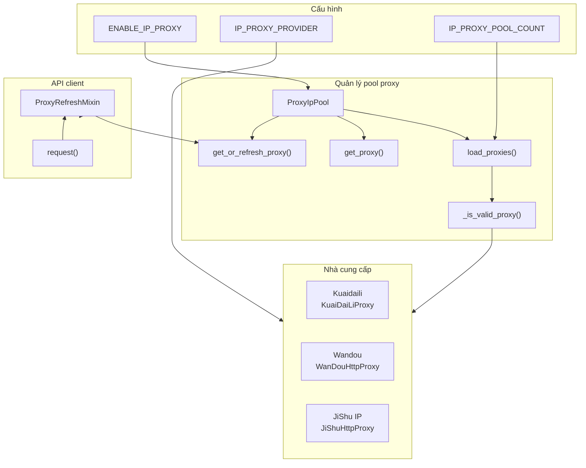

### 6.2 Luồng đăng nhập

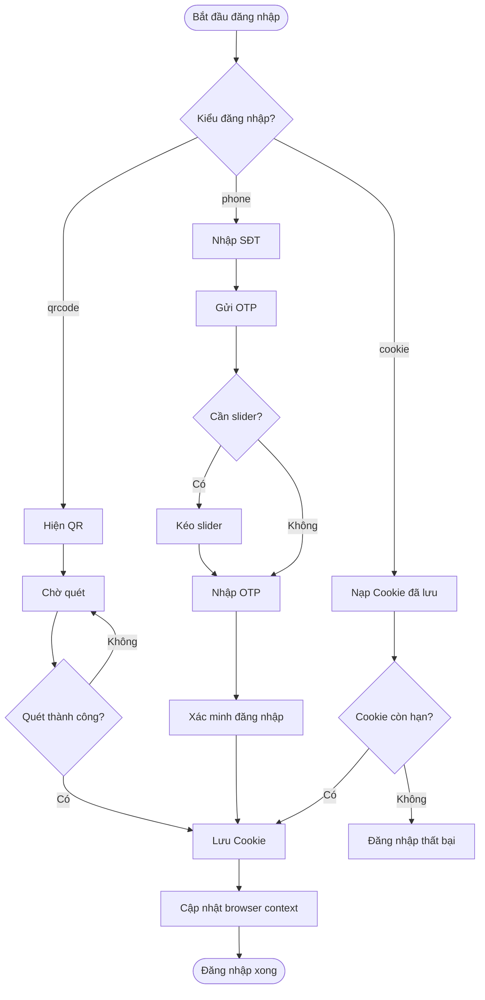

### 6.3 Quản lý trình duyệt

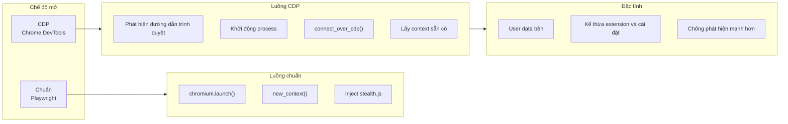

### 6.4 Hệ thống cache

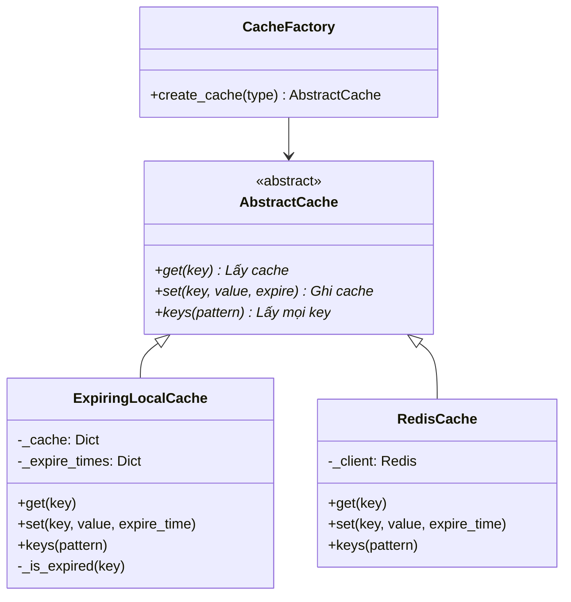

---

## 7. Model dữ liệu

### 7.1 Quan hệ ORM

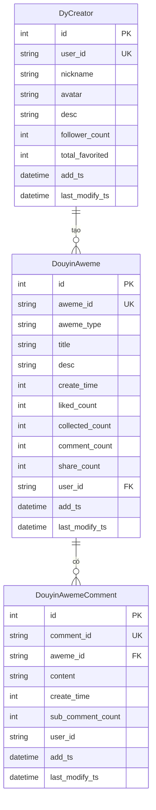

### 7.2 Bảng theo nền tảng

| Nền tảng | Bảng nội dung | Bảng comment | Bảng creator |
|------|--------|--------|---------|
| Douyin | DouyinAweme | DouyinAwemeComment | DyCreator |
| Xiaohongshu | XHSNote | XHSNoteComment | XHSCreator |
| Kuaishou | KuaishouVideo | KuaishouVideoComment | KsCreator |
| Bilibili | BilibiliVideo | BilibiliVideoComment | BilibiliUpInfo |
| Weibo | WeiboNote | WeiboNoteComment | WeiboCreator |
| Tieba | TiebaNote | TiebaNoteComment | - |
| Zhihu | ZhihuContent | ZhihuContentComment | ZhihuCreator |

> Lưu ý: các bảng hồ sơ creator đã gỡ; user ID được hash thành `creator_hash`. Trend Radar lưu thêm `data/trend.sqlite`.

---

## 8. Hệ thống cấu hình

### 8.1 Mục cấu hình lõi

```python
# config/base_config.py

# Chọn nền tảng
PLATFORM = "xhs"  # xhs, dy, ks, bili, wb, tieba, zhihu

# Đăng nhập
LOGIN_TYPE = "qrcode"  # qrcode, phone, cookie
SAVE_LOGIN_STATE = True

# Crawler
CRAWLER_TYPE = "search"  # search, detail, creator
KEYWORDS = "编程副业,编程兼职"
CRAWLER_MAX_NOTES_COUNT = 15
MAX_CONCURRENCY_NUM = 1

# Comment
ENABLE_GET_COMMENTS = True
ENABLE_GET_SUB_COMMENTS = False
CRAWLER_MAX_COMMENTS_COUNT_SINGLENOTES = 10

# Trình duyệt
HEADLESS = False
ENABLE_CDP_MODE = True
CDP_DEBUG_PORT = 9222

# Proxy
ENABLE_IP_PROXY = False
IP_PROXY_PROVIDER = "kuaidaili"
IP_PROXY_POOL_COUNT = 2

# Lưu trữ
SAVE_DATA_OPTION = "jsonl"  # csv, db, json, jsonl, sqlite, mongodb, excel, postgres
```

### 8.2 Cấu hình database

```python
# config/db_config.py

# MySQL
MYSQL_DB_HOST = "localhost"
MYSQL_DB_PORT = 3306
MYSQL_DB_NAME = "media_crawler"

# Redis
REDIS_DB_HOST = "127.0.0.1"
REDIS_DB_PORT = 6379

# MongoDB
MONGODB_HOST = "localhost"
MONGODB_PORT = 27017

# SQLite
SQLITE_DB_PATH = "database/sqlite_tables.db"
```

---

## 9. Module tiện ích

### 9.1 Tổng quan hàm tiện ích

| Module | File | Chức năng chính |
|------|------|---------|
| App runner | `app_runner.py` | Signal, thoát nhẹ, dọn dẹp |
| Mở trình duyệt | `browser_launcher.py` | Phát hiện đường dẫn, mở process |
| Quản lý CDP | `cdp_browser.py` | Kết nối CDP, context trình duyệt |
| Tiện ích crawler | `crawler_util.py` | QR, captcha, User-Agent |
| Ghi file | `async_file_writer.py` | Ghi CSV/JSON bất đồng bộ, wordcloud |
| Slider | `slider_util.py` | Xử lý captcha kéo |
| Thời gian | `time_util.py` | Timestamp, ngày |

### 9.2 Quản lý chạy ứng dụng

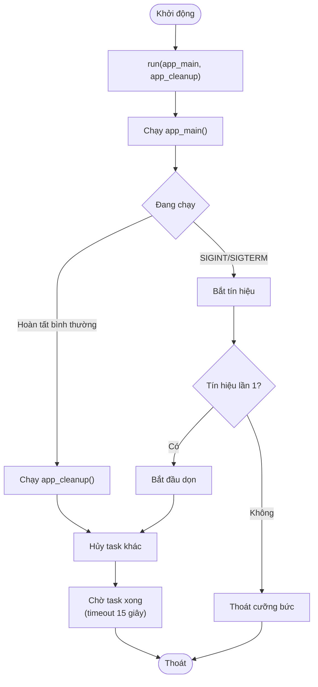

---

## 10. Quan hệ phụ thuộc module

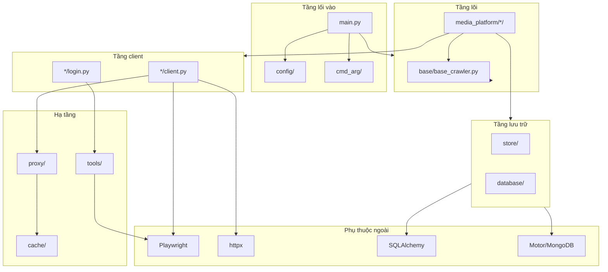

---

## 11. Hướng dẫn mở rộng

### 11.1 Thêm nền tảng mới

1. Tạo thư mục mới trong `media_platform/`
2. Implement các file lõi:
   - `core.py` — kế thừa `AbstractCrawler`
   - `client.py` — kế thừa `AbstractApiClient` và `ProxyRefreshMixin`
   - `login.py` — kế thừa `AbstractLogin`
   - `field.py` — enum nền tảng
3. Tạo thư mục lưu trữ tương ứng trong `store/`
4. Đăng ký trong `CrawlerFactory.CRAWLERS` của `main.py`

### 11.2 Thêm cách lưu mới

1. Tạo class implement mới trong `store/`
2. Kế thừa `AbstractStore`
3. Implement `store_content`, `store_comment`, `store_creator`
4. Đăng ký trong `StoreFactory.STORES` của từng nền tảng

### 11.3 Thêm nhà cung cấp proxy

1. Tạo class mới trong `proxy/providers/`
2. Kế thừa `BaseProxy`
3. Implement `get_proxy()`
4. Đăng ký trong cấu hình

---

## 12. Tham chiếu nhanh

### 12.1 Lệnh thường dùng

```bash
# Khởi động crawler
python main.py

# Chỉ định nền tảng
python main.py --platform xhs

# Chỉ định cách đăng nhập
python main.py --lt qrcode

# Chỉ định kiểu crawler
python main.py --type search
```

### 12.2 Đường dẫn file then chốt

| Mục đích | Đường dẫn |
|------|---------|
| Entry | `main.py` |
| Cấu hình lõi | `config/base_config.py` |
| Cấu hình DB | `config/db_config.py` |
| Lớp cơ sở crawler | `base/base_crawler.py` |
| Model ORM | `database/models.py` |
| Pool proxy | `proxy/proxy_ip_pool.py` |
| Trình duyệt CDP | `tools/cdp_browser.py` |

---

*Trend Radar — crawler kế thừa MediaCrawler. Tài liệu WebUI: [webui-guide.md](webui-guide.md).*
