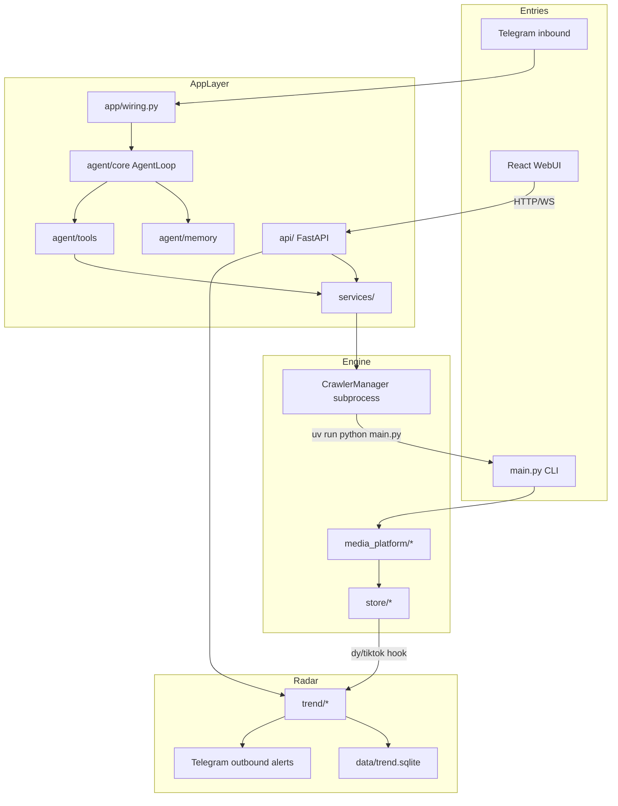
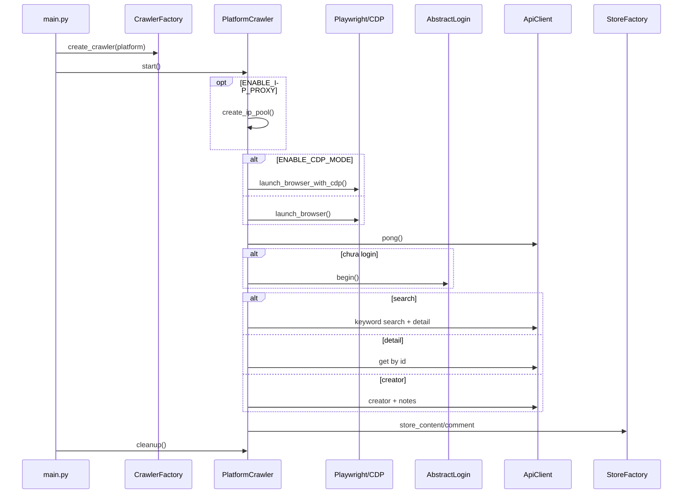
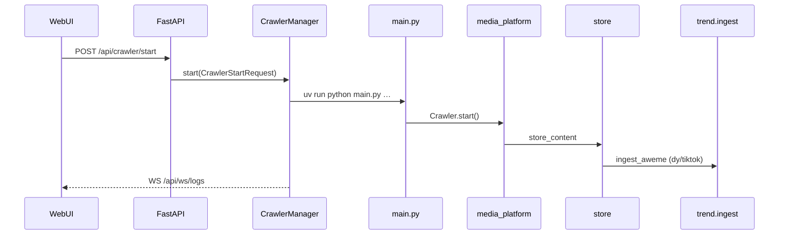
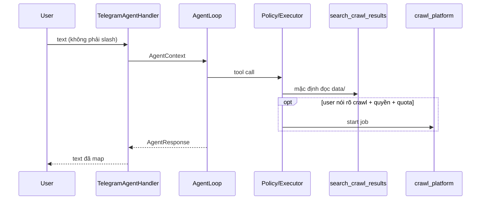
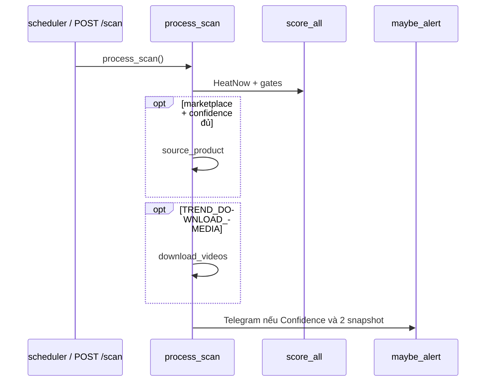

# Kiến trúc Trend Radar

Tài liệu này mô tả **cây mã đang chạy**. Không dùng [agent-telegram-architecture.md](../agent-telegram-architecture.md) (design record, path cũ) làm nguồn sự thật.

Cây thư mục ngắn: [code-structure.md](../code-structure.md). Hướng dẫn vận hành: [usage.md](usage.md).

---

## 1. Sản phẩm ở tầng hệ thống

Trend Radar là sản phẩm **agent-orchestrated**:

1. Crawl Douyin (nguồn nhiệt chính) và tùy chọn TikTok VN.
2. Nhận diện SKU (`product_id` / 小黄车) hoặc tên lặp trên nhiều video.
3. Chấm **HeatNow** + **Confidence 0–5** trên **hai snapshot**.
4. Gửi Telegram outbound khi đủ ngưỡng.
5. Tùy chọn: LLM gợi ý tên, tải mp4, draft Shopee/Lazada.

Crawler đa nền tảng (`media_platform/`, `main.py`) là **engine nội bộ** (fork MediaCrawler, xem [NOTICE](../../NOTICE)). WebUI, FastAPI, Agent và Telegram inbound **không** import crawler để chạy in-process. Hợp đồng subprocess bất biến:

```text
uv run python main.py
```

---

## 2. Sơ đồ hệ thống và luật phụ thuộc



Luật phụ thuộc (cũng ghi trong `docs/code-structure.md`):

```text
channels → agent → tools → services → crawler engine
api routers → services
TelegramAdapter ↛ SQL, ↛ media_platform
AgentLoop ↛ SQL (dùng AgentMemory)
```

| Được | Không được |
|------|------------|
| Channel chuẩn hóa tin nhắn → `AgentContext` | Channel chọn tool, ghép argv crawl, query DB |
| Agent gọi tool đã đăng ký | Agent chạy SQL, shell, DB client |
| Tool gọi application service | Tool import `media_platform` để crawl |
| Service gọi `CrawlerManager` | Manager implement crawler |
| Douyin/TikTok store hook `trend.ingest` | Trend scrape 蝉妈妈 / FastMoss / checkout Shopee |

Hai đường Telegram **không** dùng chung quyền:

- Outbound: `trend/alerts.py` → `TREND_TELEGRAM_CHAT_ID`
- Inbound: `channels/telegram/` → AgentLoop. Token alert **không** cấp quyền hội thoại.

---

## 3. `app/` — composition root

Không chứa business crawl.

| File | Vai trò |
|------|---------|
| `app/wiring.py` | Ráp registry, memory, AgentLoop, Telegram handler |
| `app/cli.py` | Alias: `runpy.run_module("main")`. Subprocess crawler vẫn là `main.py` |
| `app/__init__.py` | Package marker |

`build_tool_registry()` đăng ký đúng hai tool:

- `SearchCrawlResultsTool(CrawlResultService)`
- `CrawlPlatformTool(CrawlerJobService(crawler_manager))`

`build_memory()` → `create_agent_memory()`. `build_agent_loop()` gắn `OpenAICompatibleAgentLLM` + registry + memory. `build_telegram_handler()` gắn `LegacyCommandHandler` + `TelegramUserResolver` + loop.

Test: `tests/test_app_wiring.py`, `tests/test_product_identity.py`.

---

## 4. `agent/core/` — vòng lặp bounded

Agent **không** sở hữu crawler hay storage. Nó lập kế hoạch trong số bước hữu hạn, gọi tool allowlist, trả lời chỉ từ `ToolResult`.

| File | Vai trò |
|------|---------|
| `contracts.py` | `AgentContext`, `AgentHistoryMessage`, `ToolCall`, `ToolResult`, `LLMResponse`, `AgentResponse` |
| `loop.py` | `AgentLoop.run` — timeout request, lock hội thoại, bước LLM/tool |
| `llm.py` | `OpenAICompatibleAgentLLM`; tắt khi `AGENT_LLM_ENABLED=false` |
| `registry.py` | Allowlist theo tên; từ chối đăng ký tên SQL/shell |
| `executor.py` | Validate input, authz, timeout từng tool, chặn duplicate fingerprint |
| `policy.py` | Cấm SQL/shell/DB client trên **tên tool và arguments** |
| `prompts.py` | System prompt: không bịa, không crawl trừ khi user nói rõ |
| `__init__.py` | Package |

### 4.1 `AgentContext` (không chứa secret)

Pydantic `extra=forbid`. Metadata key chứa `secret` / `token` / `api_key` / `cookie` / `password` / `authorization` bị reject.

Trường vận hành: `channel`, `actor_id`, `user_id`, `telegram_chat_id`, `conversation_id`, `message`, `authenticated`, `license`, `permissions`, `quota_remaining`, `current_job_id`, `history`.

### 4.2 `AgentLoop`

1. Nếu có memory: lấy/tạo conversation, `acquire_lock`, restore short-term state, lưu user message, nạp history.
2. Lặp tối đa `MAX_AGENT_STEPS` (mặc định 4): LLM trả `final_answer` **hoặc** `tool_calls`.
3. Tool chạy song song trong một bước; fingerprint SHA-256 chặn gọi trùng trong cùng request.
4. Hết bước → status `max_steps`. Timeout request → `timeout`. Lock fail → `conversation_busy`.

Timeout mặc định: request 45s, mỗi tool 10s (`config/agent_config.py`).

### 4.3 Policy + executor authz

`inspect_tool_name` / `inspect_tool_call` chặn tên kiểu `sql`, `shell`, `subprocess`, URI `postgres://`, lệnh `psql`/`mysql`/`sqlite3`, và câu SQL có động từ + mệnh đề (`SELECT … FROM`). Keyword sản phẩm kiểu “drop hoodie” **không** bị cấm.

Executor còn kiểm:

- `context.authenticated`
- `context.license == "active"`
- `required_permission` ∈ `permissions`
- `requires_quota` và `quota_remaining > 0`

### 4.4 LLM

Khi `AGENT_LLM_ENABLED` tắt, client không gọi HTTP; loop vẫn chạy với hành vi fallback trong `llm.py`. Prompt hệ thống **không** thay policy — policy vẫn chặn ở executor.

Test: `tests/test_agent_loop.py`, `tests/test_agent_policy.py`.

---

## 5. `agent/memory/` — hội thoại, không phải crawler DB

Engine **riêng** (`database/agent_session.py` + `database/agent_memory.db` mặc định). Không phụ thuộc `SAVE_DATA_OPTION`.

| File | Vai trò |
|------|---------|
| `factory.py` | `create_agent_memory()` ráp store + cache + lock |
| `service.py` | `AgentMemoryService` — conversation, message, tool-call, short-term |
| `store.py` | `SqlAgentMemoryStore` |
| `state.py` | Short-term TTL (job id, idea ids) |
| `lock.py` | Lock theo conversation (memory dict hoặc Redis) |
| `sanitizer.py` | Redact secret trước khi ghi |
| `contracts.py` / `errors.py` | Kiểu và lỗi (`AgentMemoryLockTimeout`, …) |

ORM (`database/agent_models.py`):

- `agent_conversations` — unique `(user_id, channel, telegram_chat_id)`
- `agent_messages` — role user/assistant/system/tool
- `agent_tool_calls` — arguments/result đã sanitize, status, latency

Cache: `AGENT_MEMORY_CACHE_TYPE=memory|redis`. Redis đi qua `cache/cache_factory.py`.

Test: `tests/test_agent_memory.py`.

---

## 6. `agent/tools/` — đúng hai tool đang register

Không mô tả catalog thiết kế chưa có (`TrendQuery`, `CrawlerStatus`, …).

| Tool | Class | Service | Quyền | Hành vi |
|------|-------|---------|-------|---------|
| `search_crawl_results` | `SearchCrawlResultsTool` | `CrawlResultService` | `crawl_results:read` | Đọc JSON/JSONL/CSV dưới `data/{platform}/`. Không start crawler, không mở DB |
| `crawl_platform` | `CrawlPlatformTool` | `CrawlerJobService` | `crawler:run` + quota | `start_keyword_crawl` → `CrawlerManager.start` mode search |

Input Pydantic `extra=forbid`: `platform` ∈ 8 mã, `keyword` 1–256, `limit` 1–100.

`CrawlResultService` chỉ tìm trong `title` / `desc` / `content` / `source_keyword` / `keywords`. Path phải nằm trong `data/`.

`CrawlerJobService` nếu process đang chạy thì trả `status=running` (không spawn thêm).

---

## 7. `channels/telegram/` — inbound mỏng

| File | Vai trò |
|------|---------|
| `adapter.py` | `TelegramAgentHandler.handle` |
| `auth.py` | `TelegramUserResolver` → identity, license, permissions, quota |
| `presenter.py` | `TelegramResponseMapper` — `AgentResponse` → text Telegram (tiếng Việt cho lỗi) |
| `contracts.py` | `TelegramUpdate`, `TelegramMessageResponse` |

Luồng:

- `update.text` bắt đầu bằng `/` → `LegacyCommandHandler` (slash cũ `/status`, `/crawl`, …). Update **không** bị sửa.
- Còn lại → build `AgentContext` (`channel="telegram"`, `conversation_id=telegram:{chat}:{user}`) → `AgentLoop.run` → mapper.

Cấm trong channel: SQL, import `media_platform`, chọn tool, ghép CLI.

Outbound alerts **không** đi qua package này.

Test: `tests/test_telegram_agent_integration.py`.

---

## 8. `services/` — HTTP-free

Đã chuyển từ `api/services/`. Router FastAPI và Agent tool **cùng** gọi lớp này.

| File | Vai trò |
|------|---------|
| `crawler_manager.py` | Một `Popen` tại một thời điểm; argv từ `CrawlerStartRequest`; log ring 500; queue WebSocket |
| `crawler_job_service.py` | Facade start keyword crawl cho Agent |
| `crawl_result_service.py` | Đọc file crawl đã persist |

`CrawlerManager` cwd = project root, lệnh `uv run python main.py` + flags. Status: `idle` / `running` / `stopping` / `error`.

---

## 9. `api/` — FastAPI

`api/main.py`: title “Trend Radar API”, CORS `localhost:5173` và `:3000`, static WebUI từ `api/webui/` (output `npm run build`), lifespan `trend.scheduler.start_scheduler` / `stop_scheduler`.

Router gắn prefix `/api`:

| Prefix / path | File | Việc |
|---------------|------|------|
| `/api/crawler` | `routers/crawler.py` | `POST /start`, `/stop`, `GET /status`, `/logs` |
| `/api/data` | `routers/data.py` | liệt kê/preview JSON/CSV/Excel dưới `data/` |
| `/api/ws/logs`, `/api/ws/status` | `routers/websocket.py` | stream log và status |
| `/api/trend` | `routers/trend.py` | settings, products, alerts, scan, scheduler, marketplace, media, telegram test |
| `/api/health`, `/api/env/check` | `main.py` | health; env check chạy `uv run main.py --help` |

Schema `api/schemas/crawler.py`: `CrawlerStartRequest` (platform, login, type, keywords/IDs, comment, save option, cookies, headless, max notes/comments ≤ 10000).

`GET /` phục vụ `api/webui/index.html` nếu đã build; không thì JSON nhắc build.

---

## 10. `webui/` — React / Vite

Không gọi crawler trong trình duyệt.

| Khu | File |
|-----|------|
| App / tabs | `src/App.tsx` |
| SCAN/CRAWL | `components/config/CrawlerConfigPanel.tsx` |
| TREND_RADAR | `components/trend/TrendRadarPanel.tsx` |
| Terminal | `components/console/*` |
| Data explorer | `components/data/*` |
| Env check | `components/env/EnvironmentCheck.tsx` |
| API client | `lib/api.ts` |
| WS / crawler hook | `hooks/useWebSocket.ts`, `hooks/useCrawler.ts` |
| State | `store/crawlerStore.ts`, `store/themeStore.ts` |
| i18n | `i18n/locales/{vi-VN,en-US,zh-CN}/` |

Dev: Vite `:5173` proxy `/api` (kể cả WS) sang `:8080`. Hướng dẫn UI: [webui-guide.md](../webui-guide.md) và [usage.md](usage.md).

---

## 11. `main.py` + `cmd_arg/` + `var.py`

`CrawlerFactory.CRAWLERS`:

| Mã | Class |
|----|--------|
| `xhs` | `XiaoHongShuCrawler` |
| `dy` | `DouYinCrawler` |
| `ks` | `KuaishouCrawler` |
| `bili` | `BilibiliCrawler` |
| `wb` | `WeiboCrawler` |
| `tieba` | `TieBaCrawler` |
| `zhihu` | `ZhihuCrawler` |
| `tiktok` | `TikTokCrawler` |

`cmd_arg/arg.py` (Typer) ghi đè `config.*` rồi crawler đọc module-level config. Flag: `--platform`, `--lt`, `--type`, `--start`, `--keywords`, `--get_comment`, `--get_sub_comment`, `--headless`, `--save_data_option`, `--init_db`, `--cookies`, `--specified_id`, `--creator_id`, `--crawler_max_notes_count`, `--max_concurrency_num`, proxy flags.

Cleanup: flush Excel, wordcloud nếu bật, đóng browser. `var.py` giữ contextvars (`crawler_type_var`, …).

`recv_sms.py`: webhook OTP cho login phone (không khuyến nghị).

---

## 12. Engine crawler: `base/` + `media_platform/`

### 12.1 ABC (`base/base_crawler.py`)

- `AbstractCrawler` — `start`, `search`, `launch_browser`, `launch_browser_with_cdp`
- `AbstractLogin` — QR / mobile / cookie
- `AbstractStore` — content / comment / creator / media
- `AbstractApiClient` — `request`, `update_cookies`

Client thường mixin `proxy/proxy_mixin.py` (`ProxyRefreshMixin`).

### 12.2 Pattern mỗi nền tảng

```text
media_platform/{platform}/
  core.py        # crawler
  client.py      # HTTP + Playwright/CDP
  login.py
  field.py
  help.py
  exception.py   # hầu hết platform
```

Đặc thù:

| Nền tảng | Thêm |
|----------|------|
| `xhs` | `extractor.py`, `playwright_sign.py`, `xhs_sign.py`; `XHS_INTERNATIONAL` → rednote.com |
| `kuaishou` | `graphql.py` + `graphql/*.graphql` |
| `tieba` | HTML extractor, `test_data/` |
| `douyin` / `tiktok` | store hook `trend.ingest` |

### 12.3 Vòng đời một lần crawl



Ba mode: `search` (keyword), `detail` (ID), `creator` (toàn bộ nội dung tác giả).

---

## 13. `store/` — ghi crawler

Mỗi platform có factory map `SAVE_DATA_OPTION` → implement: csv, json, jsonl, sqlite, db (MySQL), mongodb, excel, postgres.

`store/excel_store_base.py`: buffer + `flush_all()` lúc shutdown.

Hook Trend Radar **chỉ** Douyin và TikTok:

```text
store/douyin/__init__.py  → trend.ingest.ingest_aweme("dy", ...)
store/tiktok/__init__.py  → trend.ingest.ingest_aweme("tiktok", ...)
```

Comment Douyin/TikTok cũng `ingest_comment` khi có intent regex.

Test: `tests/test_store_factory.py`, `tests/test_excel_store.py`.

---

## 14. `database/` — hai engine

| Nhóm | File | Dùng cho |
|------|------|----------|
| Crawler ORM | `models.py`, `db.py`, `db_session.py` | Khi `SAVE_DATA_OPTION` là sqlite/mysql/postgres |
| Mongo | `mongodb_store_base.py` | `mongodb` |
| Agent memory | `agent_models.py`, `agent_session.py` | Hội thoại Agent, path riêng |

Bảng crawler (creator profile đã gỡ; còn `creator_hash`):

| Nền tảng | Content | Comment | Creator |
|----------|---------|---------|---------|
| Douyin | DouyinAweme | DouyinAwemeComment | DyCreator (hash) |
| Xiaohongshu | XHSNote | XHSNoteComment | XHSCreator |
| Kuaishou | KuaishouVideo | KuaishouVideoComment | KsCreator |
| Bilibili | BilibiliVideo | BilibiliVideoComment | BilibiliUpInfo |
| Weibo | WeiboNote | WeiboNoteComment | WeiboCreator |
| Tieba | TiebaNote | TiebaNoteComment | — |
| Zhihu | ZhihuContent | ZhihuContentComment | ZhihuCreator |

Pydantic vận chuyển: `model/m_{platform}.py`.

---

## 15. `trend/` — radar

```text
store dy/tiktok → ingest.py → extract.py (+ optional llm_extract)
                → store.py (data/trend.sqlite)
scheduler / POST /api/trend/scan
                → score.py (HeatNow, gates, Confidence)
                → alerts.py (Telegram outbound)
                → optional media.py, marketplace.py
```

| File | Vai trò |
|------|---------|
| `settings.py` | Merge default `trend_config` → `data/trend_settings.json` → env |
| `store.py` | SQLite: products, videos, comments, snapshots, alerts, listings, scan_runs |
| `extract.py` | Tên / `product_id` / `product_key` |
| `ingest.py` | Upsert product+video; comment intent regex (muốn mua / 求链接 / giá / …) |
| `score.py` | Metrics, HeatNow min-max theo peer, gates, label |
| `google_trends.py` | Cổng xác nhận `geo=CN` — **không** cộng vào HeatNow |
| `alerts.py` | Format + `send_telegram`; cooldown |
| `scheduler.py` | Vòng nền interval/cron; `process_scan` |
| `media.py` | Tải mp4 |
| `marketplace.py` | Draft search Shopee/Lazada (`TREND_ORDER_MODE=draft`) |
| `llm_extract.py` | Gợi ý tên khi extract rỗng; không thay cổng |

HeatNow (trọng số mặc định):

```text
0.35 play_velocity + 0.20 eng_velocity + 0.20 mention
+ 0.15 spread + 0.10 intent_wilson
```

Mỗi cổng được min-max theo peer cùng industry, trừ `intent_wilson` (Wilson lower bound, đã 0–1).

Confidence (cộng 1 cho mỗi cổng đúng, tối đa 5):

1. Có `product_id` / 小黄车
2. mention ≥ `TREND_MIN_MENTION` **và** spread ≥ `TREND_MIN_SPREAD`
3. play_velocity tăng so với snapshot trước
4. intent_n và Wilson đủ ngưỡng
5. Google Trends CN = `rising`

Label: chưa có snapshot trước → `QUAN SAT`. Heat ≥ `TREND_HOT_HEATNOW` → `DANG HOT`. Vùng giữa + mention tăng + delta đủ → `DU KIEN NONG`.

Telegram outbound chỉ khi Confidence ≥ `TREND_MIN_CONFIDENCE` (mặc định 4) **và** `two_snapshots`.

Test: `tests/test_trend_radar.py`.

---

## 16. `config/`

| File | Phạm vi |
|------|---------|
| `base_config.py` | Platform, login, crawler type, keywords, CDP, proxy, `SAVE_DATA_OPTION`, comment, concurrency |
| `db_config.py` | MySQL, Redis, MongoDB, SQLite crawler path |
| `{xhs,dy,ks,bilibili,weibo,tieba,zhihu,tiktok}_config.py` | ID list, sort, đặc thù |
| `trend_config.py` | Default radar + env |
| `agent_config.py` | LLM, bước, timeout, memory path/cache |

Trend ghi đè: module default → `data/trend_settings.json` → biến môi trường.

Agent mặc định: LLM tắt, memory SQLite `database/agent_memory.db`, cache in-process.

---

## 17. Hạ tầng: `proxy/`, `cache/`, `tools/`, `libs/`

### Proxy

`proxy/proxy_ip_pool.py` + `providers/`: `kuaidaili`, `wandouhttp`, `static` (`STATIC_PROXY_URL`). Mixin refresh trên client. Chi tiết: [proxy.md](../proxy.md).

### Cache

`AbstractCache` → `ExpiringLocalCache` / `RedisCache`. Crawler dùng cho login state. Agent memory tái sử dụng factory khi `AGENT_MEMORY_CACHE_TYPE=redis`.

### tools/

| File | Việc |
|------|------|
| `cdp_browser.py` | Connect Chrome DevTools |
| `browser_launcher.py` | Tìm binary, mở process |
| `app_runner.py` | Signal, shutdown 15s |
| `async_file_writer.py` | CSV/JSON/JSONL + wordcloud |
| `crawler_util.py` | QR, UA |
| `slider_util.py` | Captcha kéo |
| `httpx_util.py` | HTTP helper |
| `user_hash.py` | `creator_hash` |

### libs/

`stealth.min.js`, `douyin.js`, `zhihu.js` — inject / ký request.

---

## 18. `tests/`

| File | Invariant |
|------|-----------|
| `test_app_wiring.py` | Composition root ráp đúng tool |
| `test_product_identity.py` | Tên sản phẩm Trend Radar, không phải MediaCrawler façade |
| `test_agent_loop.py` | Bước, timeout, evidence |
| `test_agent_policy.py` | Cấm SQL/shell; cho phép keyword sản phẩm |
| `test_agent_memory.py` | Store, lock, sanitizer |
| `test_telegram_agent_integration.py` | Slash vs chat thường |
| `test_trend_radar.py` | Ingest, score, gates |
| `test_api_limits.py` | Giới hạn API |
| platform / store / CDP / proxy | Engine crawler |

Chạy: `uv run pytest`.

---

## 19. Ba luồng runtime

### 19.1 WebUI start crawl



### 19.2 Telegram chat thường



### 19.3 Trend score



---

## 20. Mở rộng

**Nền tảng mới**

1. `media_platform/{name}/` kế thừa ABC
2. `store/{name}/` factory
3. `model/m_{name}.py`, `config/{name}_config.py`
4. Đăng ký `CrawlerFactory` + enum CLI/API

**Tool Agent mới**

1. Class với `name`, `input_model`, `required_permission`, `execute`
2. `build_tool_registry()` trong `app/wiring.py`
3. Test policy: tên không dính SQL/shell

**Proxy provider**

1. `proxy/providers/` kế thừa `BaseProxy`
2. Implement `get_proxy()`
3. Đăng ký theo `IP_PROXY_PROVIDER_NAME`

Không thêm SQL tool. Không cho channel import crawler.
