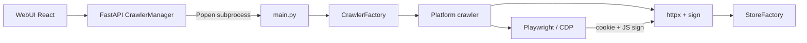
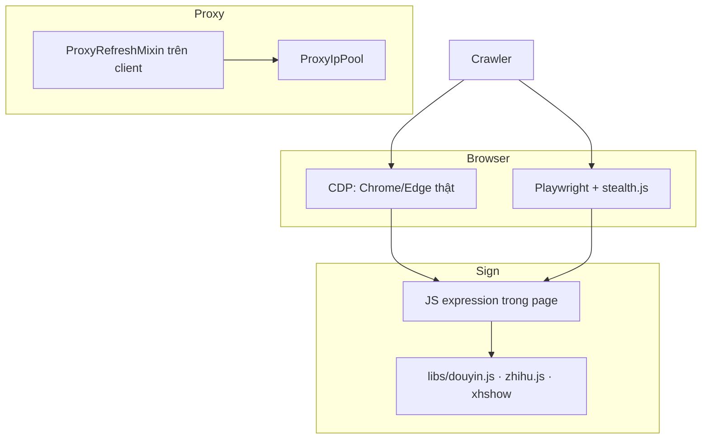

# Kiến trúc MediaCrawler

Framework crawler đa nền tảng (Python 3.11+, asyncio). Playwright giữ phiên đăng nhập, httpx gọi API đã ký, StoreFactory ghi dữ liệu ra file hoặc database.

Hai lối vào — CLI và WebUI — cùng đổ vào một crawler core.

> Tài liệu này phản ánh code hiện tại (kể cả lớp FastAPI/WebUI). File `docs/项目架构文档.md` là bản tiếng Trung cũ hơn, chưa mô tả đầy đủ WebUI.

---

## 1. Tổng quan

| Hạng mục | Giá trị |
|----------|---------|
| Nền tảng | `xhs` · `dy` · `ks` · `bili` · `wb` · `tieba` · `zhihu` |
| Lối vào | CLI (`main.py`) · WebUI (React + FastAPI) |
| Mode crawl | `search` · `detail` · `creator` |
| Login | `qrcode` · `phone` · `cookie` |
| Lưu trữ | `jsonl` (mặc định) · `json` · `csv` · `excel` · `sqlite` · `db` (MySQL) · `postgres` · `mongodb` |
| Browser | CDP Chrome/Edge (mặc định) · Playwright Chromium + stealth.js |

Nguyên tắc kỹ thuật: **không reverse crypto**. Chữ ký request lấy bằng JS expression trong browser context đã đăng nhập.

Phạm vi: NON-COMMERCIAL LEARNING LICENSE — chỉ dùng để học tập, tôn trọng ToS nền tảng, không crawl quy mô lớn.

---

## 2. Năm tầng hệ thống

```
┌─────────────────────────────────────────────────────────────┐
│  1. Lối vào                                                 │
│     CLI (Typer)  ·  WebUI React :5173  ·  recv_sms          │
└────────────────────────────┬────────────────────────────────┘
                             │
┌────────────────────────────▼────────────────────────────────┐
│  2. Điều phối                                               │
│     FastAPI CrawlerManager  ·  CrawlerFactory  ·  config    │
│     cmd_arg  ·  tools.app_runner                            │
└────────────────────────────┬────────────────────────────────┘
                             │
┌────────────────────────────▼────────────────────────────────┐
│  3. Crawler nền tảng                                        │
│     AbstractCrawler / AbstractLogin / AbstractApiClient     │
│     media_platform/{xhs,douyin,kuaishou,bilibili,weibo,     │
│                      tieba,zhihu}                           │
└────────────────────────────┬────────────────────────────────┘
                             │
┌────────────────────────────▼────────────────────────────────┐
│  4. Hạ tầng                                                 │
│     Playwright / CDP  ·  ProxyIpPool  ·  Cache              │
│     libs/*.js (sign + stealth)                              │
└────────────────────────────┬────────────────────────────────┘
                             │
┌────────────────────────────▼────────────────────────────────┐
│  5. Lưu trữ                                                 │
│     StoreFactory → jsonl/json/csv/excel/sqlite/mysql/       │
│                    postgres/mongodb                         │
└─────────────────────────────────────────────────────────────┘
```

### 2.1 Lối vào

- **CLI:** `uv run python main.py` — Typer trong `cmd_arg/arg.py` ghi đè `config.*`.
- **WebUI:** Vite (`webui/`, port 5173) proxy `/api` sang FastAPI (`api/main.py`, port 8080).
- WebUI **không** crawler in-process. `CrawlerManager` spawn subprocess `uv run python main.py`, đọc stdout, đẩy log qua WebSocket `/api/ws/logs`.
- `recv_sms.py` là FastAPI phụ để nhận SMS OTP khi login bằng điện thoại.

### 2.2 Điều phối

- `CrawlerFactory` trong `main.py` map 7 mã nền tảng sang class crawler.
- `config/base_config.py` là nguồn cấu hình; các `*_config.py` của nền tảng được import ở cuối file.
- `tools.app_runner.run()` bắt SIGINT/SIGTERM, dọn CDP/browser, timeout 15 giây.

### 2.3 Crawler nền tảng

Mỗi nền tảng là một plugin cùng contract:

```
media_platform/{platform}/
  core.py       AbstractCrawler — start / search / launch_browser
  client.py     AbstractApiClient + ProxyRefreshMixin — httpx
  login.py      AbstractLogin — qrcode / phone / cookie
  field.py      Enum sort, note type
  help.py       Parse URL, search_id
  exception.py  DataFetchError, IPBlockError, ...
```

XHS thêm `extractor.py`, `xhs_sign.py`, `playwright_sign.py`. Kuaishou thêm `graphql.py`. Tieba parse HTML (parsel) thay vì JSON API thuần.

### 2.4 Hạ tầng

- CDP mặc định: `ENABLE_CDP_MODE=True`, `CDP_CONNECT_EXISTING=True`, port 9222 — gắn Chrome/Edge user.
- Fallback: Playwright Chromium + `libs/stealth.min.js`, user-data-dir theo nền tảng.
- Proxy: `kuaidaili` · `wandouhttp` · `static` (URL tĩnh). File `jishu_http_proxy.py` còn đó nhưng không đăng ký trong `IpProxyProvider`.
- Cache: memory (`ExpiringLocalCache`) hoặc Redis — dùng cho phiên/proxy, không phải store nội dung.

### 2.5 Lưu trữ

Mỗi nền tảng có StoreFactory riêng trong `store/{platform}/`. `SAVE_DATA_OPTION` chọn implement.

ORM (`database/models.py`) chỉ còn **content + comment**. User ID hash thành `creator_hash`, nickname được mask (`tools.user_hash`). Các bảng hồ sơ creator đã gỡ.

---

## 3. Luồng điều khiển



WebUI spawn CLI như subprocess. Browser cấp cookie/sign cho httpx. Client đẩy payload đã parse vào StoreFactory.

---

## 4. Vòng đời một lần crawl

| Bước | Thành phần | Hành động |
|------|------------|-----------|
| 1. Bootstrap | `app_runner` + `config` | Signal handler, override config từ CLI/API |
| 2. Factory | `CrawlerFactory` | Khởi tạo lớp crawler theo `PLATFORM` |
| 3. Proxy (opt) | `proxy.ProxyIpPool` | Lấy IP, format cho Playwright + httpx |
| 4. Browser | `CDPBrowserManager` / Playwright | CDP connect Chrome sẵn có, hoặc `chromium.launch` + stealth.js |
| 5. Auth | `AbstractLogin` + `Client.pong()` | qrcode / phone / cookie; cập nhật cookie vào httpx |
| 6. Crawl | `search` \| `detail` \| `creator` | Semaphore `MAX_CONCURRENCY_NUM`; comment / sub-comment / media optional |
| 7. Persist | StoreFactory | Ẩn danh user, ghi content/comment/creator |
| 8. Cleanup | `async_cleanup` | Đóng CDP/context, close DB, flush Excel |

Kết thúc CLI: flush Excel nếu cần, optional wordcloud từ comment JSON/JSONL.

---

## 5. Bảy plugin nền tảng

| Mã | Class | API / host | Ký request | Dữ liệu |
|----|-------|------------|------------|---------|
| `xhs` | `XiaoHongShuCrawler` | edith.xiaohongshu.com / rednote.com | xhshow + Playwright sign | Ghi chú, comment, creator |
| `dy` | `DouYinCrawler` | douyin.com | `libs/douyin.js` | Video, comment, creator |
| `ks` | `KuaishouCrawler` | kuaishou.com GraphQL | Cookie context | Video, comment, creator |
| `bili` | `BilibiliCrawler` | bilibili.com | Cookie context | Video, dynamic, comment |
| `wb` | `WeiboCrawler` | weibo.com | Cookie context | Weibo, comment, media |
| `tieba` | `TieBaCrawler` | tieba.baidu.com | HTML extractor | Post, comment |
| `zhihu` | `ZhihuCrawler` | zhihu.com | `libs/zhihu.js` | Q&A, comment, creator |

Đăng ký tại `CrawlerFactory.CRAWLERS` trong `main.py`.

Ba mode:

| Mode | Config | Việc làm |
|------|--------|----------|
| `search` | `KEYWORDS` | Tìm theo từ khóa, lấy danh sách rồi detail |
| `detail` | ID chỉ định | Lấy đúng bài/video đã biết |
| `creator` | ID creator | Lấy toàn bộ nội dung trang tác giả |

---

## 6. WebUI và API

```
webui/          React 18 + Vite + Zustand + TanStack Query
  src/lib/api.ts          Axios client `/api`
  src/hooks/useWebSocket.ts   Singleton WS `/api/ws/logs`
  src/store/crawlerStore.ts   Trạng thái crawler + logs

api/
  main.py                 FastAPI app, CORS, static `api/webui/`
  routers/crawler.py      POST /start /stop  GET /status /logs
  routers/data.py         List / preview / download file trong `data/`
  routers/websocket.py    /ws/logs  /ws/status
  services/crawler_manager.py   Subprocess + log queue
  schemas/crawler.py      Pydantic request/response
```

Luồng WebUI:

1. React gửi `POST /api/crawler/start` với `CrawlerStartRequest`.
2. `CrawlerManager._build_command()` tạo argv `uv run python main.py --platform ...`.
3. `subprocess.Popen` chạy CLI, stdout không buffer (`PYTHONUNBUFFERED=1`).
4. Mỗi dòng log → `LogEntry` → queue → broadcast WebSocket.
5. Stop: SIGTERM, chờ tối đa 15s, rồi SIGKILL.

Build frontend: `cd webui && npm run build` → output `api/webui/`. Uvicorn phục vụ static khi thư mục tồn tại.

Dev: Vite `:5173` proxy `/api` (kể cả WS) sang `:8080`.

---

## 7. Lưu trữ và mô hình dữ liệu

### 7.1 StoreFactory

Ví dụ XHS (`store/xhs/__init__.py`):

```python
class XhsStoreFactory:
    STORES = {
        "csv": XhsCsvStoreImplement,
        "db": XhsDbStoreImplement,
        "postgres": XhsDbStoreImplement,
        "json": XhsJsonStoreImplement,
        "jsonl": XhsJsonlStoreImplement,
        "sqlite": XhsSqliteStoreImplement,
        "mongodb": XhsMongoStoreImplement,
        "excel": XhsExcelStoreImplement,
    }
```

| `SAVE_DATA_OPTION` | Implement | Phù hợp |
|--------------------|-----------|---------|
| `jsonl` | JsonlStoreImplement | Mặc định, append, scale |
| `json` / `csv` | Json / Csv + `AsyncFileWriter` | Xem nhanh, interchange |
| `excel` | `ExcelStoreBase.flush_all()` | Báo cáo; flush lúc exit |
| `sqlite` | SqliteStoreImplement | Local, không cần server |
| `db` / `postgres` | DbStoreImplement | MySQL `asyncmy` / Postgres `asyncpg` |
| `mongodb` | MongoStoreImplement | Document linh hoạt |

Nếu option là sqlite/mysql/db/postgres, `main.py` gọi `db.init_db()` trước khi crawl để tránh lỗi `no such table`.

### 7.2 ORM

| Nền tảng | Content | Comment |
|----------|---------|---------|
| Bilibili | `bilibili_video` + `bilibili_up_dynamic` | `bilibili_video_comment` |
| Douyin | `douyin_aweme` | `douyin_aweme_comment` |
| Kuaishou | `kuaishou_video` | `kuaishou_video_comment` |
| Weibo | `weibo_note` | `weibo_note_comment` |
| XHS | `xhs_note` | `xhs_note_comment` |
| Tieba | `tieba_note` | `tieba_comment` |
| Zhihu | `zhihu_content` | `zhihu_comment` |

Pydantic models nằm ở `model/m_{platform}.py` (parse URL / payload), tách khỏi ORM.

### 7.3 Privacy

Teaching edition **không** persist user ID, avatar, IP, homepage, chữ ký, giới tính.

- `tools.user_hash.anonymize_user_id` → cột `creator_hash` (chỉ để nhóm “cùng một tác giả”).
- `mask_nickname` trước khi ghi.
- Các bảng `XhsCreator` / `DyCreator` / `WeiboCreator` / `TiebaCreator` / `ZhihuCreator` / `BilibiliUpInfo` đã xóa.

---

## 8. Cấu hình

Nguồn chính: `config/base_config.py` (import luôn các `*_config.py` nền tảng). Database: `config/db_config.py`.

Các biến then chốt:

```python
PLATFORM = "xhs"                 # xhs | dy | ks | bili | wb | tieba | zhihu
LOGIN_TYPE = "qrcode"            # qrcode | phone | cookie
CRAWLER_TYPE = "search"          # search | detail | creator
KEYWORDS = "..."
SAVE_DATA_OPTION = "jsonl"
ENABLE_CDP_MODE = True
CDP_CONNECT_EXISTING = True
ENABLE_IP_PROXY = False
ENABLE_GET_COMMENTS = True
ENABLE_GET_SUB_COMMENTS = False
ENABLE_GET_MEIDAS = False
MAX_CONCURRENCY_NUM = 1
```

CLI ghi đè config qua Typer (`--platform`, `--lt`, `--type`, `--save_data_option`, `--keywords`, `--specified_id`, `--creator_id`, …).

---

## 9. Hạ tầng chống phát hiện



- CDP dùng cookie, extension, lịch sử trình duyệt thật → giảm fingerprint automation.
- Client kế thừa `ProxyRefreshMixin`: hết hạn / bị chặn thì xin IP mới rồi retry.
- SSL verify có thể tắt (`DISABLE_SSL_VERIFY`) chỉ khi đi qua proxy MITM (Burp, mitmproxy) — không dùng production.

---

## 10. Phụ thuộc runtime

| Vai trò | Package | Dùng ở |
|---------|---------|--------|
| Browser automation | playwright | Launch / CDP / cookie / JS sign |
| HTTP client | httpx + tenacity | API nền tảng, retry |
| Web control plane | fastapi + uvicorn + websockets | `api/main.py`, `recv_sms.py` |
| ORM SQL | sqlalchemy + asyncmy / aiosqlite / asyncpg | `database/` |
| Mongo | motor | MongoStoreImplement |
| CLI | typer | `cmd_arg/arg.py` |
| Frontend | React 18, Vite, Zustand, TanStack Query | `webui/` |
| Media / NLP | opencv, pillow, jieba, wordcloud, pandas, openpyxl | slider, media, export |

---

## 11. Context biến toàn cục

`var.py` dùng `contextvars` (không dùng global mutable xuyên task):

| Biến | Ý nghĩa |
|------|---------|
| `crawler_type_var` | Mode hiện tại (`search` / `detail` / `creator`) |
| `source_keyword_var` | Từ khóa đang crawl — gắn vào record lưu trữ |
| `comment_tasks_var` | Task comment đang chạy |
| `request_keyword_var` | Keyword gắn với request |
| `db_conn_pool_var` | Pool aiomysql (legacy) |

---

## 12. Thêm nền tảng mới

1. Tạo `media_platform/foo/` với `core.py` / `client.py` / `login.py` (kế thừa abstract trong `base/base_crawler.py`).
2. Đăng ký trong `CrawlerFactory.CRAWLERS`.
3. Thêm `store/foo/` StoreFactory + bảng ORM nếu dùng SQL.
4. Thêm `PlatformEnum` ở `cmd_arg/arg.py` và `api/schemas/crawler.py`.
5. Tạo `config/foo_config.py`, import từ cuối `base_config.py`.
6. Thêm Pydantic model `model/m_foo.py` nếu parse URL/payload riêng.

Thêm storage backend: implement `AbstractStore` (`store_content` / `store_comment` / `store_creator`), đăng ký vào `STORES` của từng nền tảng.

Thêm proxy provider: kế thừa `ProxyProvider`, implement `get_proxy()`, đăng ký trong `IpProxyProvider` tại `proxy/proxy_ip_pool.py`.

---

## 13. File then chốt

| Mục đích | Đường dẫn |
|----------|-----------|
| Entry CLI | `main.py` |
| Abstract | `base/base_crawler.py` |
| Config | `config/base_config.py`, `config/db_config.py` |
| CLI flags | `cmd_arg/arg.py` |
| API WebUI | `api/main.py` |
| Process manager | `api/services/crawler_manager.py` |
| ORM | `database/models.py` |
| Session SQL | `database/db_session.py` |
| Proxy pool | `proxy/proxy_ip_pool.py` |
| CDP | `tools/cdp_browser.py` |
| Graceful shutdown | `tools.app_runner.py` |
| Frontend | `webui/src/App.tsx` |

---

## 14. Lệnh thường dùng

```bash
# Crawl CLI
uv run python main.py --platform xhs --lt qrcode --type search

# Khởi tạo DB
uv run python main.py --init_db sqlite

# API + WebUI (dev)
uv run python -m api.main          # :8080
cd webui && npm run dev            # :5173, proxy /api → :8080
```
